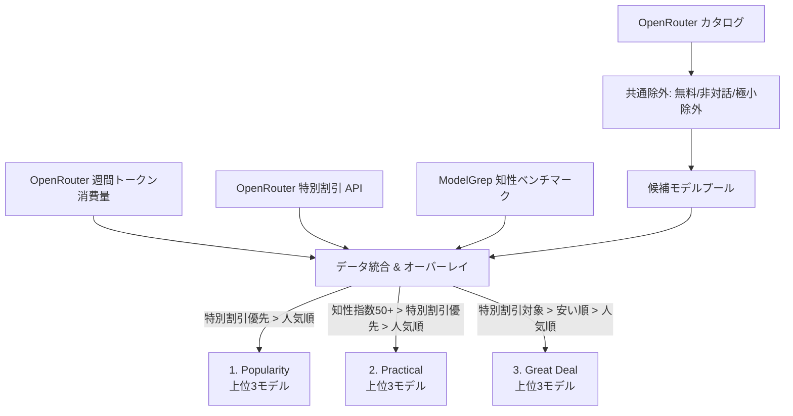

# LiteLLM 動的モデル選定仕様書 (Model Selection Specification)

本ドキュメントは、LiteLLM Proxy における動的モデル自動選定スクリプト (`update_config.py`) の選定仕様および設定ファイル生成ルールを定義します。

---

## 1. 概要と目的

OpenRouter および ModelGrep の最新データ（API）を定期的に取得・解析し、用途や目的に応じた最適なモデルを自動抽出して [config.yaml](file:///home/sexyroot/docker-dir/litellm/config.yaml) に書き出します。

従来の複雑なスコアリング計算や固定価格上限ヒューリスティックを全廃し、**「人気（トークン消費量）」「セール情報（特別割引）」「実測機能（知性ベンチマーク）」「安さ（価格）」**に基づいた明快な 3 カテゴリ（各 3 モデル）を選定します。

---

## 2. データソース

| データソース | 取得エンドポイント | 役割・取得データ |
| :--- | :--- | :--- |
| **OpenRouter 週間トークン消費量** | `/api/v1/datasets/rankings-daily?period=week` | 過去1週間の総消費トークン数（`total_tokens`）。客観的な人気順位。 |
| **OpenRouter 特別割引リスト** | `/api/frontend/v1/models/find?active=true&discount=true` | 現在 OpenRouter 公式で特別割引（セール・% off）中のモデルスラグ一覧。 |
| **ModelGrep カタログ** | `https://modelgrep.com/api/v1/models` | Artificial Analysis の知性指数（`intelligence`）、コーディング（`coding`）、機能フラグ。 |
| **OpenRouter モデルカタログ** | `/api/v1/models` | モデルの価格（prompt/completion）、コンテキスト長、プロバイダー、作成日時等。 |

---

## 3. 全カテゴリ共通の除外フィルタ

個別カテゴリの判定前に、以下の不適格モデルを除外します。

1. **常時無料モデルの除外**: `:free` サフィックス付き、または入出力価格がともに $0 のモデル（品質のばらつき、厳しいレート制限を回避するため）。
2. **非対話・非LLMモデルの除外**: `embedding`, `rerank`, `moderation`, `tts`, `transcription`, `audio-preview`, `-audio`, `-image`, `:batch` 等を含むモデル。
3. **極小コンテキスト長の除外**: 実用に耐えうるコンテキスト長（32,768 トークン以上）。
4. **固定定義モデルの除外**: `base_llm.yaml` 等で明示的に固定登録されている OpenRouter モデル（二重定義防止）。

---

## 4. カテゴリ別 選定仕様



### 1. `Popularity`（総合人気枠）
OpenRouter ユーザーから最も多く使われている（トークン消費量が多い）モデルの中から、特別割引中のものを最優先して選出します。

- **候補対象**: 共通除外を通過したすべてのモデル
- **ソート基準**:
  1. **特別割引フラグ**: 特別割引中（1） > 通常（0） （割引中モデルを最優先）
  2. **総消費トークン数**: 降順（多い順）
  3. **作成日時**: 降順（新しい順）
- **選定数**: 上位 **3モデル**
- **登録名**: `popularity-{model_name}` および グループ `popularity`

---

### 2. `Practical`（高機能・実用人気枠）
日常的な開発や高度な推論に耐えうる「高機能モデル」に絞り込み、その中で人気かつ割引中のモデルを選出します。

- **高機能の判定条件**:
  - ModelGrep（Artificial Analysis）知性指数 `intelligence >= 50.0`
  - または推論・コーディング特化フラグ（Reasoning / Coder）
  - 小型・超軽量特化モデル（1B〜3B、Nano/Mini等の低知性帯）は除外
- **ソート基準**:
  1. **特別割引フラグ**: 特別割引中（1） > 通常（0） （割引中モデルを最優先）
  2. **総消費トークン数**: 降順（多い順）
  3. **知性ベンチマークスコア**: 降順（高い順）
  4. **作成日時**: 降順（新しい順）
- **選定数**: 上位 **3モデル**
- **登録名**: `practical-{model_name}` および グループ `practical`

---

### 3. `Great Deal`（特別割引・格安コスパ枠）
現在 OpenRouter で「特別割引」が実施されているモデルの中から、安さと人気のバランスに優れたモデルを選出します。

- **候補対象**: **特別割引中（`discount=true`）のモデルに限定**
  *(※ 特別割引対象が3件未満の場合は、入力 $0.20/1M 以下の低価格モデルへフォールバック)*
- **ソート基準**:
  1. **合計価格（入力価格＋出力価格）**: 昇順（安い順）
  2. **総消費トークン数**: 降順（人気順）
  3. **作成日時 / パフォーマンス**: 降順
- **選定数**: 上位 **3モデル**
- **登録名**: `great_deal-{model_name}` および グループ `great_deal`

---

## 5. [config.yaml](file:///home/sexyroot/docker-dir/litellm/config.yaml) への書き出し構造

### ① カテゴリ代表グループ（フォールバック付き）
各カテゴリの 1位（Primary）モデルを代表グループ名として登録し、2位・3位をフォールバック先として設定します。

```yaml
model_list:
  - model_name: popularity
    model_info:
      description: "Dynamic popularity primary: [1位のモデル名]"
      supports_vision: true/false
      max_input_tokens: 131072
      input_cost_per_token: 0.0000005
      output_cost_per_token: 0.0000015
    litellm_params:
      model: openrouter/[1位のモデルID]
      api_key: os.environ/OPENROUTER_API_KEY

router_settings:
  fallbacks:
    - popularity:
        - popularity-[2位のモデルID]
        - popularity-[3位のモデルID]
```

### ② 個別モデル名の登録
各カテゴリで選出された各モデル（計9モデル）は、直接指定して利用できるようにプレフィックス付きで登録されます。

- `popularity-{provider}-{name}`
- `practical-{provider}-{name}`
- `great_deal-{provider}-{name}`

これにより、クライアントは「カテゴリ名（`popularity` 等）による自動フォールバック運用」と「個別モデル名による固定指定」の双方を選択できます。
