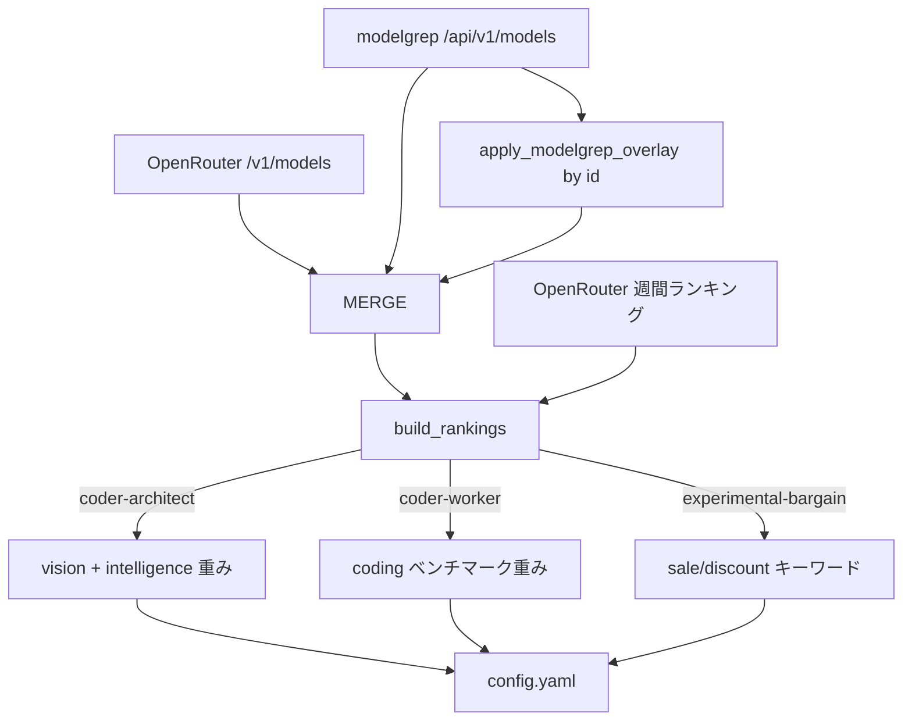

# modelgrep API を活用した動的モデル選定の改善計画

## 背景と現状

現在の [`update_config.py`](update_config.py:1) は OpenRouter `/v1/models` のカタログを取得し、
モデルの「賢さ」「コーディング適性」「マルチモーダル」を**名前トークンの推測ヒューリスティック**
（`performance_score()`  at [`update_config.py:505`](update_config.py:505)、
`is_coder_model()` / `is_reasoning_model()` / `is_vision_model()`）で判定している。

modelgrep API（`https://modelgrep.com/api/v1/models`）は、OpenRouter と同じ `id`
（例: `anthropic/claude-opus-5`）で以下の**実データ**を提供する:

- `benchmarks.artificial_analysis.intelligence` / `coding` / `agentic`（0–100 実スコア）
- `capabilities.vision` / `tools` / `reasoning`（明確な真偽値）
- `pricing.input` / `output`（USD / 100万トークン）
- `sort=downloads` / `intelligence` / `coding` / `price_input` などのサーバー側ソート

現状 `fetch_modelgrep_models()` at [`update_config.py:840`](update_config.py:840) は
`MODELGREP_COMPARE_ENABLED=1` のときのみ観測用レポートに使われているだけ。

## 決定事項（ユーザー確認済）

1. **OpenRouter カタログは維持**し、modelgrep でベンチマーク・capabilities・人気を**補完**（観測機能を本番選定へ昇格）。
2. **experimental-bargain** の「特別価格」は `description` に `sale` / `discount` / `promo` / `% off` 等のキーワードがあるものとみなす。
3. **人気（popularity）** は既存の OpenRouter 週間ランキング `fetch_openrouter_usage_rankings()` at [`update_config.py:754`](update_config.py:754) を維持。

## 3 グループの要件マッピング

| グループ | 要件 | modelgrep シグナル |
|---|---|---|
| `coder-architect` | 安い・賢さ確保・マルチモーダル優先・人気 | `intelligence` 下限 + `capabilities.vision` 重み + 週間人気 |
| `coder-worker` | 安い・賢さ確保・Coding 向け優先・人気 | `coding` ベンチマーク重み + `tools`/`reasoning` + 週間人気 |
| `experimental-bargain` | 現在特別価格で安い | `description` の sale/discount キーワード + 価格上限 |

## アーキテクチャ（データフロー）

## 実装ステップ（TODO 参照）

### 1. modelgrep 常時取得 + オーバーレイ
- `fetch_modelgrep_models()` の `MODELGREP_COMPARE_ENABLED` ゲートを解除（失敗時は警告で継続）。
- 新関数 `apply_modelgrep_overlay(openrouter_models, mg_models)` を追加: `id` が一致する OpenRouter モデルに `model["_modelgrep"] = mg_model` を付与。

### 2. modelgrep 読み取りヘルパ
- `mg_aa(model, key)` : `benchmarks.artificial_analysis[key]` を安全に取得（非有限は None）。
- `mg_cap(model, key)` : `capabilities[key]` を取得。
- `mg_pricing(model)` : modelgrep `pricing`（USD/1M）を取得。

### 3. 判定関数の本物スコア化
- `is_vision_model()` at [`update_config.py:476`](update_config.py:476): `mg_cap(model,"vision")` を優先、不在時は既存 modality ハックへフォールバック。
- `performance_score()` at [`update_config.py:505`](update_config.py:505): `mg_aa(model,"intelligence")` があればそれをベースに `coding` の軽い加算とコンテキストボーナスを適用。不在時は既存ヒューリスティックへフォールバック。

### 4. GroupConfig 拡張
- [`GROUP_CONFIGS`](update_config.py:170) に `vision_weight`（architect のみ >0）と `min_intelligence`（architect/worker の「賢さ確保」下限）を追加。
- `coder-worker` の `coding_weight` を強化し、実 `coding` ベンチマークを反映。

### 5. experimental-bargain の特別価格判定
- `is_bargain_model()` at [`update_config.py:552`](update_config.py:552) を書き換え: `description` に `sale`/`discount`/`promo`/`% off`/`deal`/`special price`/`limited` を含むかを検出。
- `qualifies_for_group()` at [`update_config.py:623`](update_config.py:623) の bargain 分岐を「キーワードあり かつ 価格上限内 かつ 常時無料(:free)除外」に変更（一時的割引に絞る）。

### 6. スコア・ソート統合
- `group_score()` at [`update_config.py:652`](update_config.py:652): `vision_weight` 項を追加（`is_vision_model` が真なら 100）。
- `build_rankings()` at [`update_config.py:1026`](update_config.py:1026): ソートキーに modelgrep シグナル（architect は vision 優先、worker は coding）を組み込みつつ、主キーは既存の `popularity_rank`（OpenRouter 週間）を維持。

### 7. 価格の単位変換とエントリ生成
- `sale_price()` at [`update_config.py:378`](update_config.py:378) / `make_public_group_entry()` at [`update_config.py:1128`](update_config.py:1128): modelgrep pricing（USD/1M）を per-token に変換（`/1_000_000`）して `input_cost_per_token` / `output_cost_per_token` に反映。

### 8. 観測レポートと env の意味更新
- `build_modelgrep_comparison()` at [`update_config.py:953`](update_config.py:953) のコメントを「本番選定で使用」に更新（レポート自体は維持）。
- `.env.example` の `MODELGREP_COMPARE_ENABLED` を「詳細比較レポートの on/off（オーバーレイ自体は常時有効）」と再定義。

### 9. 検証
- `uv run python update_config.py` を実行し `config.yaml` 生成を確認。
- ログ / Discord で 3 グループの選定上位が要件（安い・賢い・マルチモーダル / Coding / 特別価格）を満たすか確認。

## 注意点

- modelgrep の `pricing` は **USD / 100万トークン**、OpenRouter は **per token** なので変換必須。
- `id` は両者で一致するが、`:batch` 等のサフィックスは既存 `EXCLUDED_SUFFIXES` で除外済み。
- modelgrep 応答は約 1 時間キャッシュされるため、頻繁なポーリングは避ける（既存実装通り）。
- modelgrep 取得失敗時は既存ヒューリスティックへグレースフルにフォールバックし、config 生成を止めない。
